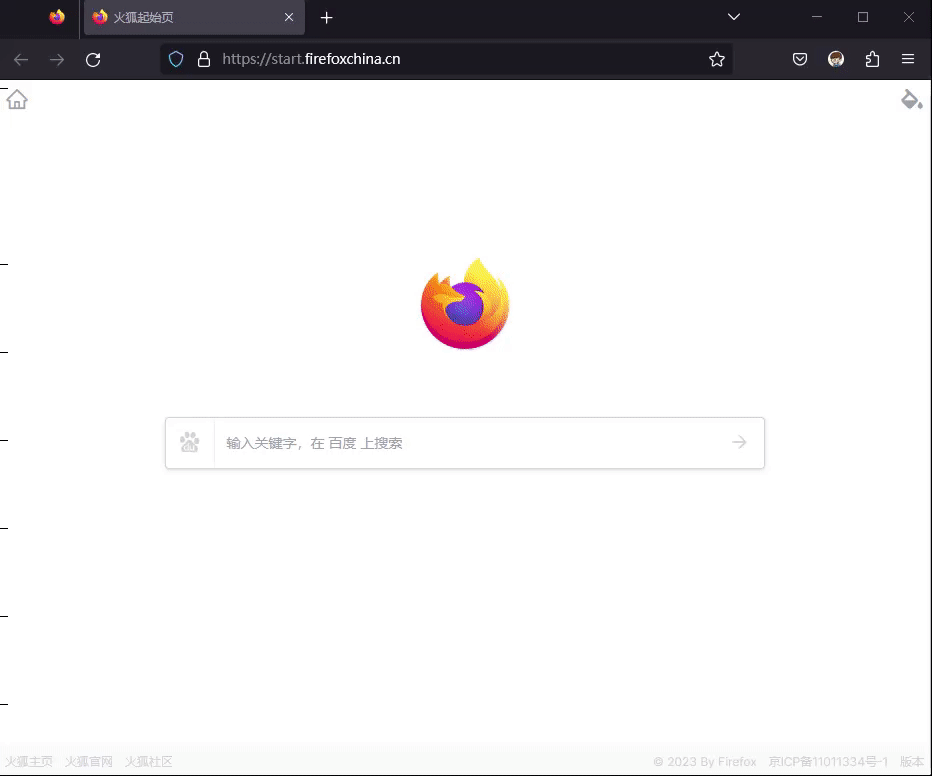
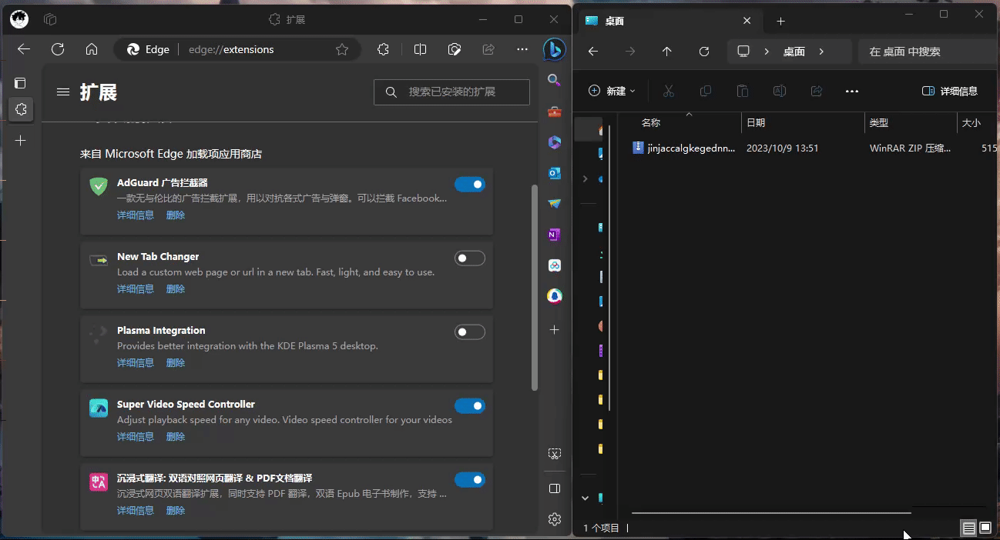

# YouthTool——智慧团建管理工具

[TOC]

##	脚本安装

智慧团建管理工具基于油猴脚本开发，需要依托于油猴插件使用，故需要在浏览器上安装油猴插件方可使用。目前比较流行的油猴插件有两款——**篡改猴 （Tampermonkey）**和**暴力猴（Violentmonkey）**。由于个人习惯常使用后者。

以下介绍类容将基于**暴力猴（Violentmonkey）**进行讲解。

###	1、暴力猴（Violentmonkey）安装

- **方法一：快速安装**

  进入插件商店，点击安装即可

  - **edge浏览器**：[👉点击安装](https://microsoftedge.microsoft.com/addons/detail/%E6%9A%B4%E5%8A%9B%E7%8C%B4/eeagobfjdenkkddmbclomhiblgggliao)

  - **chrome浏览器**：[👉点击安装](https://chrome.google.com/webstore/detail/violentmonkey/jinjaccalgkegednnccohejagnlnfdag)

  - **Firefox浏览器**：[👉点击安装](https://addons.mozilla.org/zh-CN/firefox/addon/violentmonkey/)

  - **其他浏览器**：可通过浏览器的**扩展中心（插件中心）**进行下载安装，或者点击**[谷歌插件中心](https://chrome.google.com/webstore/detail/violentmonkey/jinjaccalgkegednnccohejagnlnfdag)**进行安装，或者使用**[方法三](#way-3)**安装

    *注意*：*如果你是**chrome浏览器**或者**其他浏览器**，受网络影响，可能无法从**谷歌插件商店**获取*

    
    
    

- **方法二：官网安装**

  点击进入[暴力猴官网]([Violentmonkey](https://violentmonkey.github.io/))，选择“**GET STARTED**”进入下载界面，选择适合自己浏览器的插件版本进行安装 

  

- **方法三：crx文件安装（仅适用于chrome内核的浏览器）**

  👉[点击下载crx文件](https://chrome.zzzmh.cn/info/jinjaccalgkegednnccohejagnlnfdag)

  下载完成后，解压压缩包，将里面的**“.crx”文件**用浏览器打开完成安装

  *注：有的浏览器需要进入扩展界面，打开“开发者模式”，然后将**“.crx”文件**拖动到浏览器内方可使用*
  
  
  
###	2、脚本安装

  **暴力猴**插件支持在网站下搜索相关脚本，用户可先进入**[智慧团建官网](https://zhtj.youth.cn/zhtj/)**界面，然后点击**“暴力猴”**插件，再点击**“为站点查找脚本（GF）”**，进入**“[Greasy Fork网站](https://greasyfork.org/zh-CN/scripts)”**选择脚本进行安装

进入**“[Greasy Fork网站](https://greasyfork.org/zh-CN/scripts)”**后，选择**“[智慧团建名单批量导出](https://greasyfork.org/zh-CN/scripts/476868-智慧团建名单批量导出)”**脚本，按照提示，完成安装

用户也可以**[👉点击这里👈](https://greasyfork.org/zh-CN/scripts/476868-智慧团建名单批量导出)**，快速跳转至安装界面

*注：脚本安装完成后，需要刷新一下当前界面才能显示*

##	批量下载功能使用

登录**[智慧团建](https://zhtj.youth.cn/zhtj/)**，进入**“团员管理——团员列表”**界面，点击**“批量下载”**按键，等待完成下载任务

